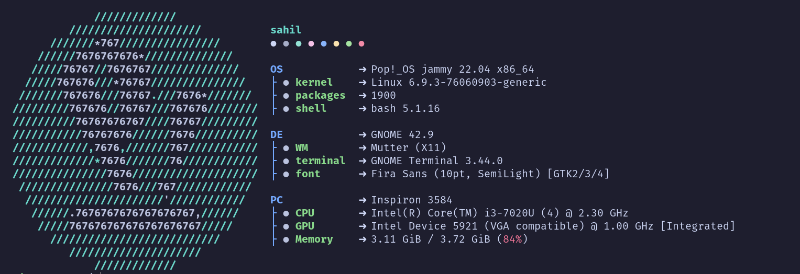

# Fastfetch Config

This repository contains my custom Fastfetch configuration for displaying system information in the terminal with a personalized aesthetic.

## Preview




## Installation

1. Clone this repository:
   ```sh
   git clone https://github.com/ShoreNexx/fastfetch-config.git
   ```
2. Move the config file to the Fastfetch config directory:
   ```sh
   mkdir -p ~/.config/fastfetch
   cp config.jsonc ~/.config/fastfetch/config.jsonc
   ```
3. Run Fastfetch:
   ```sh
   fastfetch
   ```

## Customization

You can modify the `config.jsonc` file to change colors, layout, and displayed system information. Refer to the [Fastfetch documentation](https://github.com/fastfetch-cli/fastfetch) for more customization options.

Enjoy your beautifully displayed system information! 🎉


